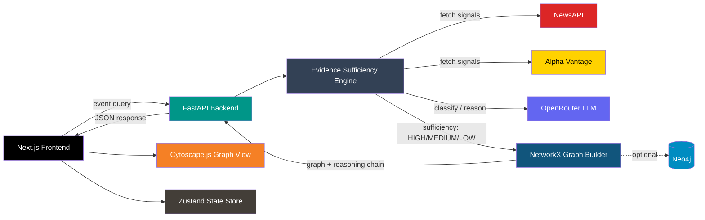

# 🌍 GeoImpact Intelligence

Production-grade real-world event impact analysis that scores evidence sufficiency and maps causal propagation — built for analysts who need signal, not speculation.

<p>
  
  
  
  
  
  
  
  
  
</p>

## ✨ Features

- **Any event category** – Wars, disasters, tariffs, cyber attacks, regulation, supply chain shocks, corporate events, and more, dynamically classified rather than hardcoded.
- **Evidence sufficiency engine** – Every event is scored HIGH / MEDIUM / LOW / INSUFFICIENT before any graph is built, so the system never fabricates a causal chain from weak data.
- **Graceful degradation** – Event not found, insufficient evidence, sparse nodes, and partial API failures all resolve to explicit, distinct UX outcomes instead of silent failure.
- **Explainable outputs** – Every graph ships with its reasoning chain, confidence scores, source health, and raw provenance so results can be audited, not just trusted.

## 🏗️ Architecture



**How it flows:**
1. The user enters an event on the Next.js frontend, which sends the query to the FastAPI backend.
2. The backend pulls raw signals from NewsAPI and Alpha Vantage, then uses OpenRouter to classify the event and assist with reasoning.
3. The evidence sufficiency engine scores the result as HIGH, MEDIUM, LOW, or INSUFFICIENT — this score gates everything downstream.
4. If sufficiency allows it, NetworkX builds the propagation graph (with Neo4j available as an optional store/fallback); the graph, reasoning chain, and confidence scores are returned to the frontend.
5. The frontend renders the graph in Cytoscape.js and manages UI state with Zustand.

## 🛠️ Tech Stack

| Layer | Technology |
|---|---|
| Frontend Framework | Next.js 14 (TypeScript) |
| Styling | Tailwind CSS |
| Graph Visualization | Cytoscape.js |
| Client State | Zustand |
| Backend Framework | FastAPI (Python 3.13) |
| Graph Computation | NetworkX |
| Graph Storage (Optional) | Neo4j |
| External Data | NewsAPI, Alpha Vantage |
| LLM Reasoning | OpenRouter |

## 🚀 Run Locally

### 1. Backend

```powershell
cd backend
python -m venv .venv
.\.venv\Scripts\activate
pip install -r requirements.txt
python -m uvicorn app.main:app --host 0.0.0.0 --port 8000 --reload
```

### 2. Frontend

```powershell
cd frontend
npm install
npm run dev
```

### 3. Environment Configuration

Create a `.env` in the project root:

```env
NEWS_API_KEY=your_key
ALPHA_VANTAGE_API_KEY=your_key
OPENROUTER_API_KEY=your_key
```

### Entry Points

| URL | View |
|---|---|
| `http://localhost:3000` | Frontend UI |
| `http://localhost:8000` | Backend API |

## 📓 Notes

- Backend targets Python 3.13 specifically.
- Neo4j is an optional fallback for graph storage/computation.
- No Docker setup is provided; both servers are run directly via venv/npm.
- Evidence sufficiency score gates graph rendering — sparse or INSUFFICIENT-rated events will not produce a full propagation graph.

---

<p align="center">
  Built by <a href="https://github.com/anirudhkhemriyaa">Anirudha Khemriya</a>
</p>